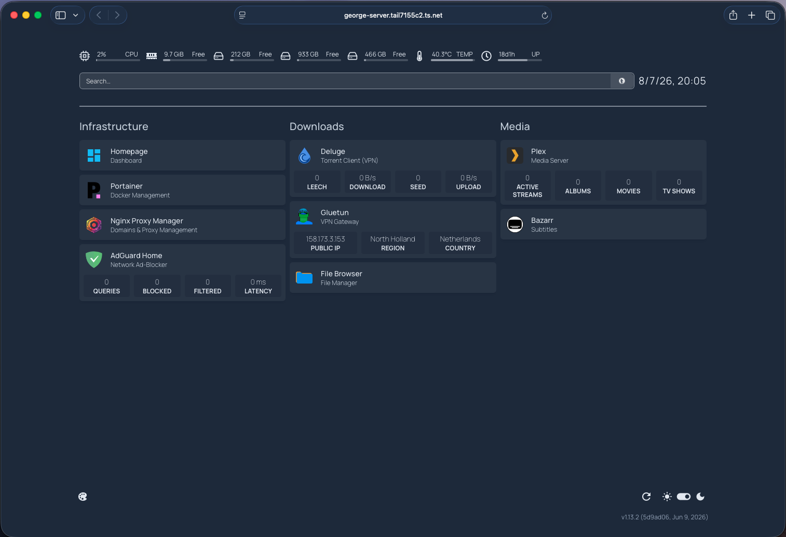
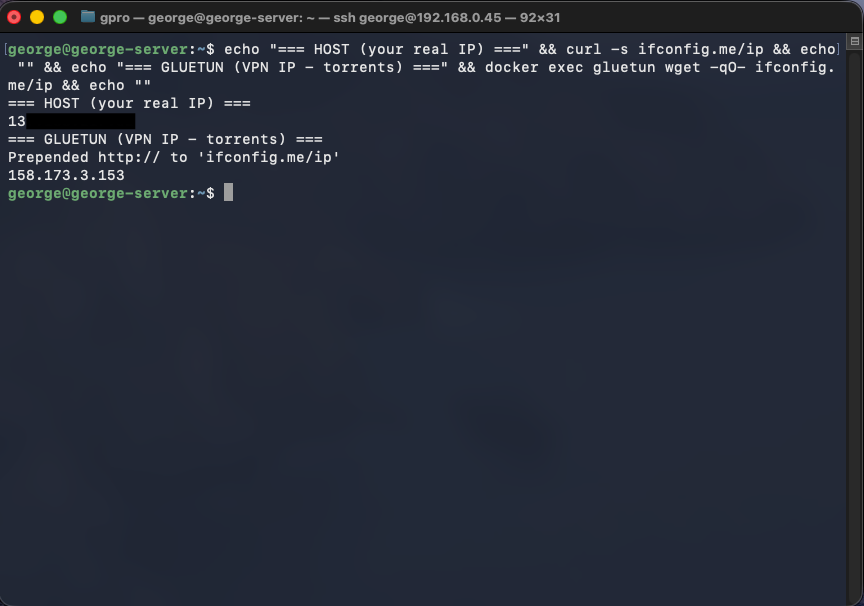
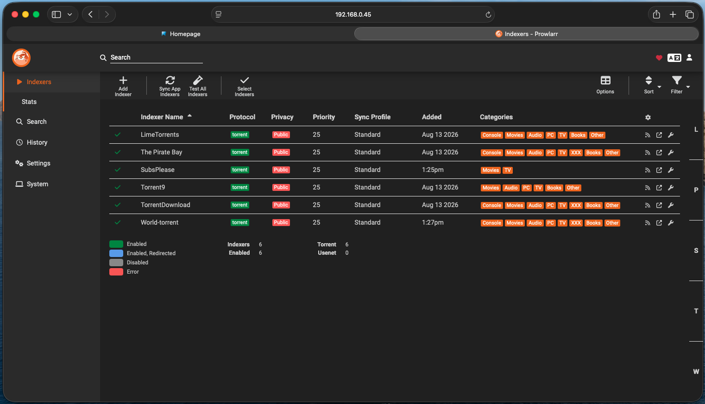
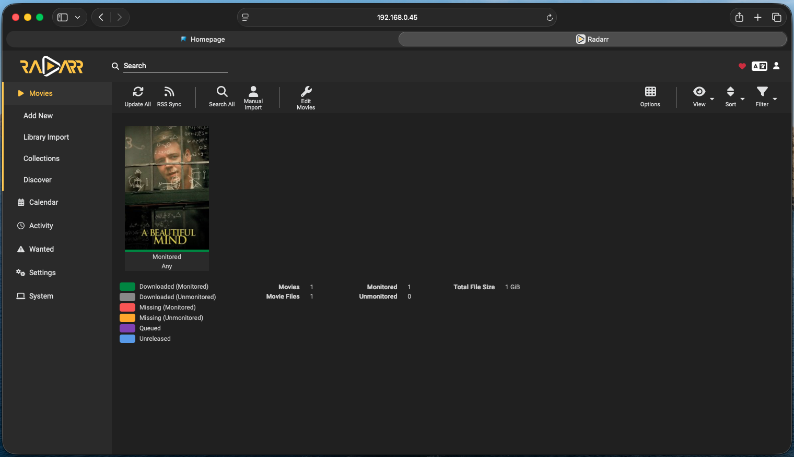
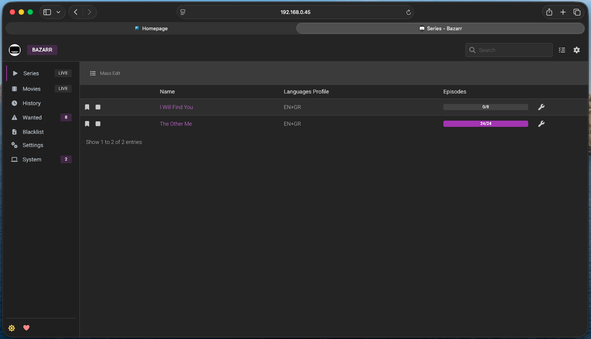
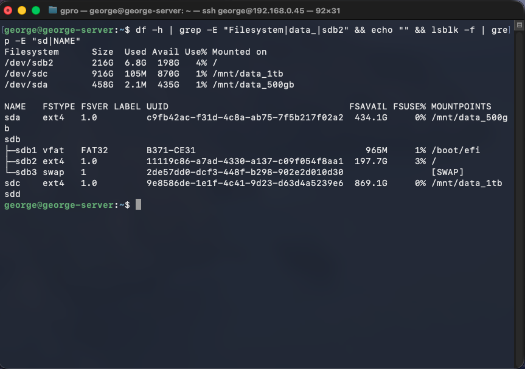
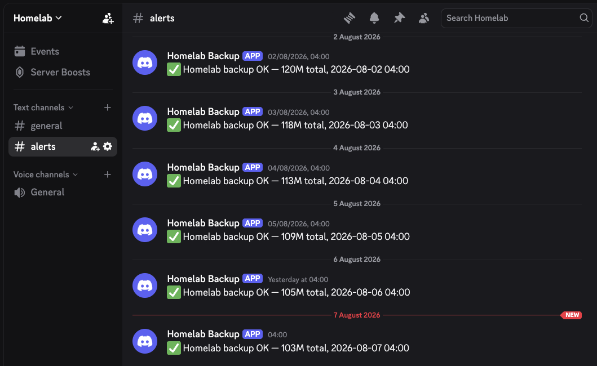

# 🏠 Homelab: Self-Hosted Media Server

A headless Debian home server running a fully containerized media pipeline: VPN-isolated torrent downloading, automated library management, Plex media streaming, automatic subtitles, network-wide services, and secure remote access, all managed from a browser with zero client-side software.

Built and documented from scratch as a hands-on infrastructure project.

**Author:** Giorgos Prodromou

---

## Overview

This project turns an old desktop (Intel i5-3470, 16 GB RAM) into a self-sufficient media server. Everything runs in Docker containers orchestrated via Portainer, with each service isolated and independently configurable.

The core design principle: **the server does the work 24/7, the client is just a remote control.** Downloads continue whether or not any personal device is on, and the entire stack is reachable securely from anywhere via a mesh VPN, without exposing anything to the public internet.



*The Homepage dashboard, accessed securely over HTTPS via Tailscale MagicDNS.*

---

## Architecture

**Debian Host (headless):**

- **Internet** enters through **gluetun** (PIA VPN with port forwarding)
- **Deluge** runs inside gluetun's network, so no traffic can leave without the VPN
- **Library automation:** Prowlarr, Sonarr, Radarr, Bazarr (shared `arrnet` bridge network)
- **Media & files:** Plex, FileBrowser Quantum
- **Network services:** AdGuard Home, Nginx Proxy Manager
- **Management:** Homepage dashboard, Portainer
- **Remote access:** Tailscale (mesh VPN + subnet router)

**Storage:**

| Disk | Mount | Purpose |
|------|-------|---------|
| 250 GB | `/` | OS + container configs |
| 500 GB | `/mnt/data_500gb` | Active downloads (temporary) |
| 1 TB | `/mnt/data_1tb` | Media library + config backups |

**Access:** Mac, iPhone, and Smart TVs connect from any network through the encrypted Tailscale mesh. Nothing is exposed to the public internet.

---

## Services

| Service | Role | Notes |
|---------|------|-------|
| **Deluge** | Torrent client | Runs inside gluetun's network, so it physically cannot leak the real IP |
| **gluetun** | VPN gateway | Private Internet Access, with **port forwarding** for better peer connectivity |
| **Prowlarr** | Indexer manager | Single source of truth for indexers; syncs them automatically to Sonarr and Radarr |
| **Sonarr** | TV library manager | Searches, grabs, imports, and organises series |
| **Radarr** | Movie library manager | Same, for films |
| **Bazarr** | Subtitles | Automatically fetches English + Greek subtitles for everything Sonarr/Radarr manage |
| **Plex** | Media server | Streams to Smart TVs, phones, browsers; remote sharing with 2FA-protected account |
| **FileBrowser Quantum** | File manager | Web UI to preview/download non-media files (books, PDFs) to any device |
| **AdGuard Home** | DNS ad-blocker | Network-level ad filtering |
| **Nginx Proxy Manager** | Reverse proxy | Clean local domains for each service |
| **Homepage** | Dashboard | Single pane of glass with live widgets (system, VPN, Plex, Deluge, *arr stack) |
| **Portainer** | Container management | Docker stack orchestration via UI |
| **Tailscale** | Mesh VPN | Secure remote access from anywhere, no exposed ports |

---

## Key Features

### VPN isolation (kill-switch by design)

Deluge uses `network_mode: service:gluetun`, so it has **no network stack of its own**. If the VPN drops, Deluge has no route to the internet whatsoever. This isn't a kill-switch that "activates"; it's a structural impossibility to leak.



*The host's real IP (Cyprus) vs. the torrent client's IP (Netherlands, via PIA). Traffic is provably isolated.*

PIA **port forwarding** is auto-synced to Deluge every 10 minutes via a cron script, improving download speeds without manual intervention.

**Scope note:** only Deluge sits behind the VPN, and deliberately so. BitTorrent is the only protocol here that broadcasts the client's IP to unknown third parties, since swarm participation is how the protocol works. Prowlarr, Sonarr, Radarr, and Bazarr make ordinary client-server HTTPS requests and never join a swarm, so routing them through the tunnel would add failure modes without addressing a real exposure.

### Library automation (*arr stack)

Prowlarr holds every indexer definition and pushes them to Sonarr and Radarr on a **Full Sync**. Add an indexer once, and both apps have it seconds later. Neither app is configured with indexers directly.



*Prowlarr as the single source of truth. Indexers are added here and synced outward.*

Sonarr and Radarr then handle search, grab, import, and folder structure; Bazarr watches their libraries and fetches subtitles unattended.



*Radarr managing the movie library: imported, monitored, and tracked.*

**Path consistency is the load-bearing detail.** All five containers mount the same two host paths at the same container paths:

```
/mnt/data_500gb/downloads : /downloads
/mnt/data_1tb/media       : /media
```

Because Deluge reports a completed file at exactly the path Sonarr expects to find it, no remote path mapping is needed anywhere in the stack. The single most common source of *arr import failures simply doesn't apply.

**Deluge labels keep the two workflows separate:**

| Label | Move-completed target | Owner |
|-------|----------------------|-------|
| `tv` / `movies` / `misc` | `/media/...` and `/downloads/misc` | manual workflow |
| `tv-sonarr` | `/downloads/tv-sonarr` | Sonarr imports from here |
| `movies-radarr` | `/downloads/movies-radarr` | Radarr imports from here |

The `*-sonarr` / `*-radarr` labels leave files on the download disk so the *arr apps can import them; the original three write straight into the library, as they always did.

### Automatic subtitles

Bazarr syncs its library from Sonarr and Radarr, then searches OpenSubtitles.com, TVSubtitles, Gestdown, and subf2m for **English and Greek** subtitles, writing `.en.srt` / `.el.srt` alongside each video. Anything it can't find goes into a Wanted queue that it retries on a schedule.



*Subtitle coverage per series, fetched unattended against the EN+GR language profile.*

**Important consequence:** Bazarr only sees content that Sonarr or Radarr have in their libraries. A file dropped into `/media` by hand is invisible to it, so see the workflow section below.

### Storage architecture

Three physical disks with clear separation of concerns. Media disks are mounted by **UUID** (not `/dev/sdX`) in `/etc/fstab` with the `nofail` flag, so a disk failure never blocks boot on a headless machine.



Data is treated as disposable (watch-and-delete), so no RAID. The focus is on protecting **configuration**, which is backed up.

One trade-off worth naming: because downloads and the library live on **different filesystems**, *arr imports are copies rather than hardlinks. Every import costs real I/O time and holds two copies until the torrent is removed. This is the accepted price of the disk separation, and the watch-and-delete approach keeps it from accumulating.

### Secure remote access (Tailscale)

The entire homelab is reachable from anywhere, whether from the office, mobile data, or traveling, through a **Tailscale mesh VPN** (WireGuard-based). Only the user's own authenticated devices can connect; **nothing is exposed to the public internet**. Subnet routing makes the whole LAN reachable, and Tailscale Serve provides automatic HTTPS with a clean hostname.

### Media workflow

Two paths, both supported, and the choice depends on how much control you want over which release gets grabbed.

**Automated.** Add a series in Sonarr or a film in Radarr, and the stack does the rest: searches every synced indexer, grabs a release, hands it to Deluge under the right label, imports on completion, and lets Bazarr fetch subtitles. Best for ongoing shows, where the weekly grind is the actual pain point.

**Manual selection with automated handling.** Pick the release yourself in Deluge (a human reading seeder counts still beats an automatic search optimising for quality score), then use **Manual Import** in Sonarr or Radarr to adopt the file. From that point on it's a managed item: organised, tracked, and subtitled like anything else.

Full step-by-step for both is in [`docs/tv-workflow.txt`](docs/tv-workflow.txt).

`scripts/organize-series.sh` is retained as a third path for content the *arr apps can't match at all. Greek-language series in particular are often absent from TheTVDB, or catalogued under names that defeat automatic matching.

### Monitoring & backups

A nightly cron job (4 AM) stops the stateful containers, archives all configs and Portainer data, keeps the last 7, and reports success or failure to a **Discord channel**, so a silent backup failure is impossible to miss.



*Automated daily backup notifications, running unattended for days.*

---

## Security Hardening

| Measure | Protection |
|---------|-----------|
| SSH key-only auth | Password login **disabled**; brute-force impossible |
| Root login disabled | No direct attacks on root |
| Fail2ban | Auto-bans repeated SSH failures |
| UFW firewall | Only required ports open |
| Unattended-upgrades | Debian security patches applied automatically |
| VPN isolation | Torrent traffic never exposes real IP |
| Plex 2FA | The only internet-facing account is protected |
| Forms auth on all *arr apps | No unauthenticated access, even on the LAN |
| Tailscale-only access | No exposed ports for management services |
| Off-site config backup | This repository (secrets excluded) |

Prowlarr's database holds indexer credentials in plaintext, and Sonarr, Radarr, and Bazarr each expose an API key that grants full control over what gets downloaded and where files are written. All four config directories are gitignored, and the exclusion is verified with `git check-ignore` rather than assumed.

---

## Repository Structure

Each service lives in its own Docker Compose stack under `stacks/`:

- `stacks/downloads/`: gluetun + Deluge (VPN-isolated)
- `stacks/arr/`: Prowlarr + Sonarr + Radarr (shared `arrnet` network)
- `stacks/bazarr/`
- `stacks/plex/`
- `stacks/filebrowser/`
- `stacks/adguard/`
- `stacks/npm/`
- `stacks/homepage/`
- `stacks/tailscale/`
- `scripts/`: backup + automation scripts
- `docs/screenshots/`

Prowlarr, Sonarr, and Radarr share a single stack rather than three: they are always deployed, updated, and debugged together, and a shared compose file gives them a common network for free. Bazarr joins that network as `external: true`, so the `arr` stack must be up first.

Every stack includes a `docker-compose.yml`. Secrets live in `.env` files (gitignored); each has a `.env.example` template showing the required variables.

---

## Setup Notes

This repo documents a personal setup; it's not a one-click deploy. To adapt it:

1. Copy each `.env.example` to `.env` and fill in your own values (VPN credentials, tokens, etc.)
2. Adjust volume paths in the compose files to match your storage
3. Deploy each stack via Portainer or `docker compose up -d`, running **`arr` before `bazarr`**, since Bazarr expects the `arrnet` network to already exist

Secrets (VPN passwords, API tokens, webhook URLs, auth keys) are **never** committed. They stay local and are excluded via `.gitignore`.

---

## Lessons & Design Decisions

- **`network_mode: service:gluetun`** over a kill-switch. Isolation by architecture beats isolation by rule.
- **VPN scope is a threat-model decision, not a default.** Only the swarm-facing container needs the tunnel; wrapping the rest would add fragility without reducing exposure.
- **Identical path mappings across every container.** The single highest-leverage decision in the *arr stack, and the reason no remote path mapping was ever needed.
- **UUID mounts + `nofail`.** The correct way to mount disks on a headless box.
- **Tailscale over port forwarding.** Remote access without an attack surface.
- **Hardware transcoding on Ivy Bridge** required the legacy `i965` VAAPI driver, not the modern `iHD`. A non-obvious fix for pre-Broadwell Intel iGPUs.
- **Automatic search is blind to swarm health.** It ranks releases by quality profile and cannot see whether anyone is still seeding. Interactive search exposes seeder counts, and for older or obscure content it is the tool to reach for. A lesson learned by watching four consecutive grabs stall at 0% before thinking to check the numbers.
- **Review the Library Import preview.** Sonarr guesses aggressively at folder-to-series matching and will import a confidently wrong match without complaint; Radarr, by contrast, flags a no-match and excludes it. Season folders sitting at the top level with the season baked into the name are a reliable way to defeat it.
- **Config-as-backup.** Data is disposable, but configuration is the real asset, hence daily backups plus this off-site repo.

---

## Possible Future Improvements

- Add better-seeded indexers, since the current public set is the limiting factor on what the automated path can actually retrieve
- Recyclarr for curated, version-controlled quality profiles
- Sonarr/Radarr → Plex notifications so the library updates on import rather than on Plex's own scan timer
- Encrypted upstream DNS (DoH/DoT) on AdGuard, to stop the ISP observing every lookup on the LAN
- Migrate PIA connection from OpenVPN to WireGuard for lower overhead
- Add Tautulli for Plex viewing statistics
- Cleanup automation (auto-delete watched media past a retention window)
- A UPS with `nut` for graceful shutdown on power loss

---

*Built as a learning project. Every component was configured, debugged, and documented hands-on.*
